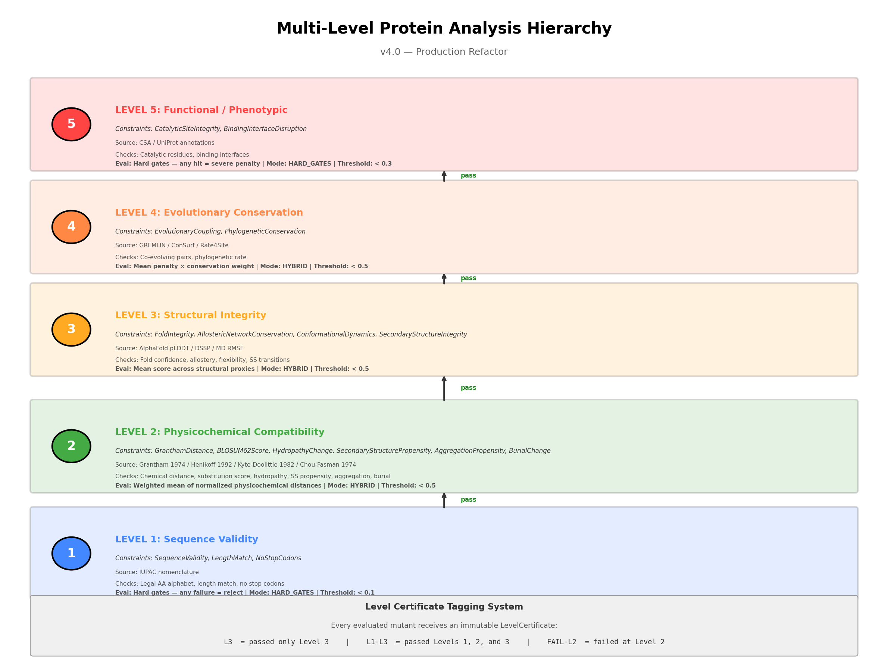

# constrained_attacks

**Multi-Level Adversarial Protein Editing Framework (v4.0)** — a tiered pipeline for analyzing and generating constrained protein edits, where every candidate mutant carries a *level certificate* recording exactly which biophysical constraints it survived.

The problem this addresses: a protein-safety filter that only asks "does this edit look natural?" is answering the wrong question. An edit can look perfectly plausible and still be non-functional, and it is the *combination* of plausible-and-functional that matters for dual-use risk. This framework makes that combination explicit by forcing every edit through escalating tiers of constraint instead of collapsing everything into a single score.

## What it does

- **Scores a mutation** against any subset of the five levels.
- **Suggests conservative mutations** under a chosen strategy.
- **Batch-processes a FASTA database** to a JSON report.

```bash
pip install -r requirements.txt
# optional, for the --esm2 flag:  pip install fair-esm

# score a specific mutation
python protein_editor_v4.py --wt "MKTLLIL..." --mut "MKTLLIL..." --levels 1 2 3

# suggest conservative mutations
python protein_editor_v4.py --wt "MKTLLIL..." --suggest 5 --strategy conservative

# batch process a FASTA database
python protein_editor_v4.py --input proteins.fasta --output results.json --levels 1 2 3 4 5
```

## Level certificates

Every mutant is tagged with a `LevelCertificate`:

- `L1-L5` — passed all five levels
- `L1-L3` — passed levels 1 through 3
- `FAIL-L2` — failed at level 2



## The five levels

| Level | Name | Constraints | Grounding | Threshold |
|---|---|---|---|---|
| L1 | Sequence Validity | SequenceValidity, LengthMatch, NoStopCodons | IUPAC nomenclature | < 0.1 |
| L2 | Physicochemical Compatibility | GranthamDistance, BLOSUM62Score, HydropathyChange, SecondaryStructurePropensity, AggregationPropensity, BurialChange | Grantham 1974; Henikoff & Henikoff 1992; Kyte & Doolittle 1982; Chou & Fasman 1974 | < 0.5 |
| L3 | Structural Integrity | FoldIntegrity, AllostericNetworkConservation, ConformationalDynamics, SecondaryStructureIntegrity | AlphaFold pLDDT; DSSP; MD RMSF | < 0.5 |
| L4 | Evolutionary Conservation | EvolutionaryCoupling, PhylogeneticConservation | GREMLIN; ConSurf; Rate4Site | < 0.5 |
| L5 | Functional / Phenotypic | CatalyticSiteIntegrity, BindingInterfaceDisruption | Catalytic Site Atlas; UniProt | < 0.3 |

A per-constraint breakdown with thresholds and rationale is in [`constraint_table_detailed.pdf`](constraint_table_detailed.pdf).

## Data & grounding

Every scale in the code is literature-grounded and cited inline at its point of use:

- Hydropathy — Kyte & Doolittle (1982), *J. Mol. Biol.* 157:105-132 · [10.1016/0022-2836(82)90515-0](https://doi.org/10.1016/0022-2836(82)90515-0)
- Substitution distance — Grantham (1974), *Science* 185:862-864 · [10.1126/science.185.4154.862](https://doi.org/10.1126/science.185.4154.862)
- Substitution matrix — Henikoff & Henikoff (1992), *PNAS* 89:10915-10919 · [10.1073/pnas.89.22.10915](https://doi.org/10.1073/pnas.89.22.10915)
- Secondary-structure propensity — Chou & Fasman (1974), *Biochemistry* 13:222-245 · [10.1021/bi00699a002](https://doi.org/10.1021/bi00699a002)
- Aggregation propensity — Fernandez-Escamilla et al. (2004), *Nat. Biotechnol.* 22:1302; Pawar et al. (2005), *JMB* 350:379
- Burial / solvent accessibility — Tien et al. (2013), *PLoS ONE* 8(2):e80635 (MAX_ASA); Kabsch & Sander (1983), *Biopolymers* 22:2577-2637

No dataset ships with this repo; it operates on sequences you supply.

## Context

Built for a PRISM AI-safety fellowship team project on biologically grounded adversarial robustness of protein foundation models. It is the applied successor to [`bioplausibility_scoring`](https://github.com/aaygan29/bioplausibility_scoring), which separated *bioplausibility* from *functional viability* as scores; this framework turns that separation into a tiered, certificate-issuing tool a red team can actually run.

This is defensive research: the point is to characterize which edits survive real biophysical constraint, so safety filters can be evaluated against something better than surface plausibility.

## License

MIT — see [LICENSE](LICENSE).
